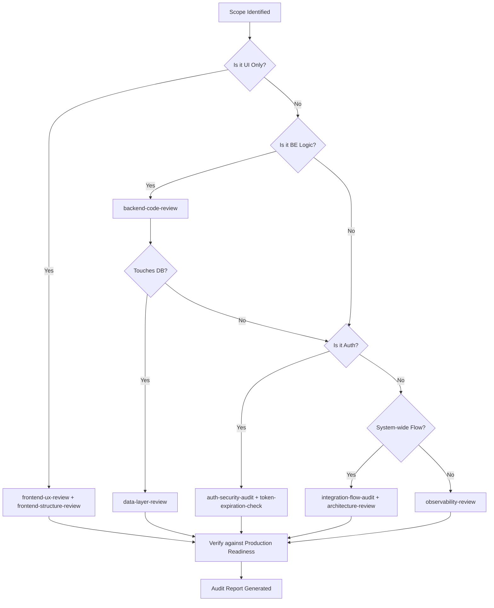

# Enterprise Audit Framework Governance

This guide defines the orchestration and execution standards for the residential access control project's audit system. All audits must comply with the dimensions and output formats defined in each individual `SKILL.md`.

## 🧭 Audit Combination Matrix

Use this matrix to determine which skills to combine based on the scope of the changes.

| Change Type           | Primary Skill               | Supporting Skills                                |
| --------------------- | --------------------------- | ------------------------------------------------ |
| **New API Feature**   | `backend-code-review`       | `data-layer-review`, `auth-security-audit`       |
| **Auth Refactor**     | `auth-security-audit`       | `token-expiration-check`, `observability-review` |
| **Structural Change** | `architecture-review`       | `integration-flow-audit`                         |
| **Frontend Feature**  | `frontend-structure-review` | `frontend-ux-review`, `integration-flow-audit`   |
| **Operational Fix**   | `observability-review`      | `backend-code-review`                            |
| **Breaking Model**    | `data-layer-review`         | `integration-flow-audit`, `architecture-review`  |

---

## 🛠️ Audit Execution Flowchart

---

## 🚦 Severity & Risk Interpretation

| Level        | Definition                                          | Mandatory Action                                        |
| ------------ | --------------------------------------------------- | ------------------------------------------------------- |
| **CRITICAL** | Direct security leak or fundamental data loss risk. | Block deployment immediately. Hotfix required.          |
| **HIGH**     | Major functional break or scalability bottleneck.   | Deployment blocked. Must be resolved in current sprint. |
| **MEDIUM**   | Violation of best practices or technical debt.      | Track in backlog. Requires plan for next sprint.        |
| **LOW**      | Minor optimization or cosmetic concern.             | Optional fix as time permits.                           |

---

## 📋 Pre-Audit Checklist

1. [ ] **Scope Isolation**: Is the exact file list or module identified?
2. [ ] **Context Alignment**: Is the business objective clearly stated for the reviewer?
3. [ ] **Cross-Skill Check**: Have you verified that this review is not better handled by a more specialized skill?

---

## 🚀 CI/CD Integration Strategy

- **Pull Request Trigger**: Automatically trigger `backend-code-review` and `frontend-structure-review` on every PR.
- **Production Baseline**: Trigger `observability-review` and `architecture-review` during pre-deployment staging phases.
- **Bi-Weekly Sync**: Deep dive using `data-layer-review` and `token-expiration-check` on core modules.

---

## 🛑 Risk Acceptance Protocol

If a **HIGH** or **MEDIUM** risk must be merged due to business urgency:

1. Document the rationale in the Audit Report.
2. Link to a technical debt ticket.
3. Obtain written approval from the Senior Architect/Tech Lead.

**CRITICAL risks must never be accepted.**