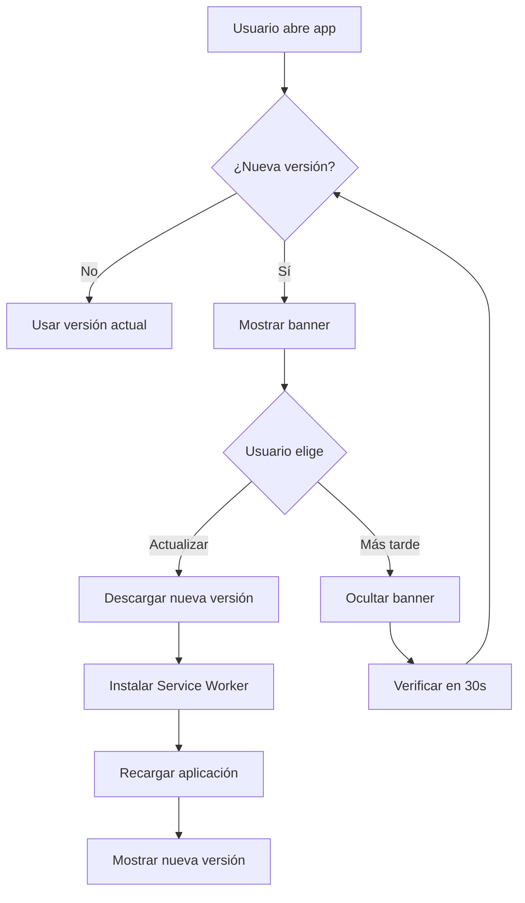

# 🔄 Sistema de Actualizaciones PWA - Residencial Access

## 📋 Descripción

Este sistema permite que los usuarios sean notificados automáticamente cuando hay una nueva versión de la aplicación disponible, sin necesidad de refrescar manualmente la página (especialmente útil en dispositivos móviles).

## 🎯 Características

- ✅ **Detección automática** de nuevas versiones
- ✅ **Banner elegante** que aparece cuando hay actualizaciones
- ✅ **Actualización con un clic** - no requiere F5 o refresh manual
- ✅ **Verificación periódica** cada 30 segundos cuando la app está activa
- ✅ **Funciona en móviles** sin necesidad de gestos especiales
- ✅ **Diseño responsive** optimizado para todos los dispositivos

## 🚀 Cómo Funciona

### Para los Usuarios

1. **Cuando hay una actualización disponible**, aparecerá un banner en la parte inferior de la pantalla con el mensaje:
   ```
   🎉 Nueva versión disponible
   Hay una actualización de la aplicación. Actualiza para obtener las últimas mejoras y correcciones.
   ```

2. El usuario tiene **dos opciones**:
   - **"Actualizar"** - Aplica la actualización inmediatamente y recarga la app
   - **"Más tarde"** - Oculta el banner (volverá a aparecer en la próxima verificación)

3. Al hacer clic en **"Actualizar"**:
   - Se descarga e instala la nueva versión
   - La página se recarga automáticamente
   - El usuario ve la versión más reciente

### Para los Desarrolladores

Cuando subas cambios a Railway o cualquier servidor, el sistema detectará automáticamente la nueva versión gracias a:

1. **Service Worker con versionado**
2. **Verificación periódica** cada 30 segundos
3. **Detección de cambios** en archivos JS, CSS, HTML

## 📝 Cómo Incrementar la Versión (Antes de Deploy)

### Opción 1: Manual

Antes de hacer deploy a Railway, actualiza la versión en:

**`frontend/public/sw.js`** (línea 2):
```javascript
const CACHE_VERSION = '2.0.1'; // Incrementar este número
```

### Opción 2: Usando el Script Helper

```bash
cd frontend
node scripts/update-version.js
```

Este script incrementará automáticamente la versión en `sw.js`.

## 🔧 Configuración Técnica

### Archivos Clave

1. **`frontend/src/components/PWA/UpdateNotification.jsx`**
   - Componente que muestra el banner de actualización
   - Maneja el registro del Service Worker
   - Verifica actualizaciones cada 30 segundos

2. **`frontend/public/sw.js`**
   - Service Worker con sistema de versionado
   - Contiene `CACHE_VERSION` que debe incrementarse en cada deploy

3. **`frontend/vite.config.js`**
   - Configuración de PWA con `registerType: 'prompt'`
   - Permite control manual de las actualizaciones

4. **`frontend/src/App.jsx`**
   - Incluye el componente `<UpdateNotification />`

## 📱 Testing

### En Desarrollo Local

1. Inicia la aplicación:
   ```bash
   npm run dev
   ```

2. Haz un cambio en cualquier archivo
3. Incrementa la versión en `sw.js`
4. Recarga la página
5. Deberías ver el banner de actualización

### En Producción

1. Haz deploy a Railway con cambios
2. Incrementa `CACHE_VERSION` en `sw.js` antes del deploy
3. Los usuarios verán el banner en los próximos 30 segundos (o al recargar la página)

## 🎨 Personalización del Banner

Para personalizar el banner, edita:

**`frontend/src/components/PWA/UpdateNotification.css`**

Puedes cambiar:
- Colores del gradiente
- Tamaño y posición
- Animaciones
- Textos en diferentes idiomas

## ⚙️ Configuración Avanzada

### Cambiar la Frecuencia de Verificación

En `UpdateNotification.jsx`, busca:

```javascript
setInterval(() => {
  registration.update();
}, 30000); // 30 segundos
```

Cambia `30000` a otro valor en milisegundos.

### Forzar Actualización Inmediata (sin prompt)

En `vite.config.js`, cambia:

```javascript
registerType: 'prompt',    // Actual (requiere confirmación)
```

a:

```javascript
registerType: 'autoUpdate', // Actualiza automáticamente sin preguntar
```

## 🐛 Troubleshooting

### El banner no aparece

1. Verifica que la versión en `sw.js` sea diferente
2. Abre DevTools → Application → Service Workers
3. Verifica que hay un service worker activo
4. Intenta "Update on reload" en DevTools

### La actualización no funciona en móvil

1. Asegúrate de que la PWA esté instalada
2. Verifica que los service workers estén habilitados
3. Revisa la consola del navegador en Remote Debug

### El banner aparece constantemente

- Incrementa solo una vez la versión por deploy
- No incrementes la versión en desarrollo

## 📊 Flujo de Actualización Completo



## 📝 Checklist para Deploy

Antes de hacer deploy a Railway:

- [ ] Hacer todos los cambios de código necesarios
- [ ] Incrementar `CACHE_VERSION` en `frontend/public/sw.js`
- [ ] Commit y push a Git
- [ ] Deploy a Railway
- [ ] Verificar que el banner aparece en producción
- [ ] Verificar que la actualización funciona correctamente

## 🎉 Beneficios

1. **Mejor UX**: Los usuarios no tienen que saber cómo refrescar la caché
2. **Actualizaciones inmediatas**: Los bugs fixes llegan a todos los usuarios rápidamente
3. **Sin confusión**: Elimina el problema de "versión antigua en caché"
4. **Mobile-friendly**: Funciona perfectamente en dispositivos móviles
5. **Profesional**: Da una imagen más pulida y moderna a la aplicación

---

**Nota**: Este sistema está completamente implementado y funcionando. Solo necesitas incrementar la versión antes de cada deploy.
